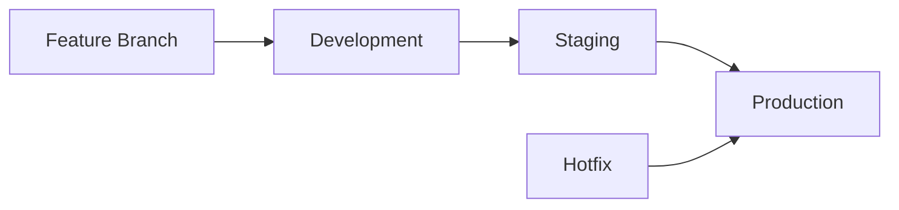

# 🚀 Guía Completa de Deployment - Railway Control System

## 🎯 Visión General

Esta guía te llevará paso a paso desde el código local hasta un deployment completo en producción, con CI/CD automatizado, monitoreo y capacidad de rollback.

## 📋 Opciones de Deployment

### 🏃‍♂️ Opción 1: Deploy Rápido (5 minutos)

**Para testing y demos rápidos**

```bash
# Deploy local con Docker
docker run -p 8080:80 tu-usuario/railway-control:latest
# ✅ Listo en http://localhost:8080
```

### 🔧 Opción 2: Deploy Completo con CI/CD (30 minutos)

**Para desarrollo profesional completo**

- ✅ GitHub Actions automatizado
- ✅ Docker Hub registry
- ✅ Azure Web App hosting
- ✅ Terraform infrastructure
- ✅ Rollback capabilities

### ☁️ Opción 3: Deploy Enterprise (60 minutos)

**Para entornos empresariales**

- ✅ Multi-environment (dev/staging/prod)
- ✅ Security scanning
- ✅ Performance monitoring
- ✅ Automated testing

## 🚀 Deploy Rápido (Opción 1)

### 📦 Using Docker Hub (Recomendado)

```bash
# 1. Pull y ejecutar imagen pre-built
docker pull tu-usuario/railway-control:latest
docker run -d -p 8080:80 --name railway-app tu-usuario/railway-control:latest

# 2. Verificar que funciona
curl http://localhost:8080
# Debe responder HTTP 200

# 3. Abrir en navegador
# http://localhost:8080
```

### 🏗️ Build Local

```bash
# 1. Clonar repositorio
git clone https://github.com/tu-usuario/railway-control.git
cd railway-control

# 2. Build con Docker
docker build -f Dockerfile -t railway-control:local .

# 3. Ejecutar
docker run -d -p 8080:80 railway-control:local

# 4. Listo!
echo "Aplicación disponible en http://localhost:8080"
```

## 🔧 Deploy Completo con CI/CD (Opción 2)

### 📋 Prerrequisitos

**Cuentas necesarias:**

- [ ] GitHub account
- [ ] Docker Hub account (gratis)
- [ ] Azure account (con créditos gratis)

**Herramientas locales:**

```bash
# Verificar instalaciones
git --version      # Para versionado
docker --version   # Para containers
az --version       # Azure CLI (para infrastructure)
terraform --version # Para Infrastructure as Code
```

### 🏗️ Paso 1: Setup de Infrastructure

1. **Configurar Azure con Terraform**

   ```bash
   # Login a Azure
   az login

   # Configurar Terraform
   cd terraform/
   terraform init
   terraform plan
   terraform apply

   # Obtener outputs importantes
   terraform output
   ```

2. **Configurar Docker Hub**

   ```bash
   # Login a Docker Hub
   docker login

   # Crear repositorio público
   # Ir a https://hub.docker.com
   # Crear repositorio: tu-usuario/railway-control
   ```

### 🔐 Paso 2: Configurar GitHub Secrets

Ve a tu repositorio GitHub > Settings > Secrets and variables > Actions

**Secrets requeridos:**

```bash
# Docker Hub
DOCKER_HUB_USERNAME=tu-usuario-dockerhub
DOCKER_HUB_TOKEN=dckr_pat_xxxxxxxxxxxxxxxxx

# Azure Web App
AZURE_WEBAPP_NAME=railway-control-app
AZURE_PUBLISH_PROFILE=<contenido-del-publish-profile-xml>

# Azure Development (opcional)
AZURE_PUBLISH_PROFILE_DEV=<contenido-del-publish-profile-dev-xml>
```

**Cómo obtener Azure Publish Profile:**

```bash
# Método 1: Azure CLI
az webapp deployment list-publishing-profiles \
  --name railway-control-app \
  --resource-group railway-control-rg \
  --xml

# Método 2: Azure Portal
# Web App > Deployment Center > Manage publish profile > Download
```

### 🔄 Paso 3: Setup de Repository

1. **Configurar Repository**

   ```bash
   # Si no tienes repo aún
   git init
   git add .
   git commit -m "feat: initial setup with complete CI/CD"
   git branch -M main
   git remote add origin https://github.com/tu-usuario/railway-control.git
   git push -u origin main
   ```

2. **Verificar Workflows**
   ```bash
   # Verificar que .github/workflows/ tiene:
   ls .github/workflows/
   # ci.yml - CI pipeline
   # release.yml - Release pipeline
   # rollback.yml - Rollback manual
   ```

### 🚀 Paso 4: Primer Deployment

1. **Crear primer release**

   ```bash
   # Crear tag de release
   git tag v1.0.0
   git push origin v1.0.0
   ```

2. **Verificar pipeline**

   ```bash
   # 1. Ve a GitHub > Actions
   # 2. Observa que "Release Pipeline" se ejecuta
   # 3. Verifica pasos:
   #    ✅ Build & Test
   #    ✅ Docker Build & Push
   #    ✅ Azure Deployment
   #    ✅ Health Check
   ```

3. **Verificar deployment**

   ```bash
   # Test de aplicación live
   curl -I https://railway-control-app.azurewebsites.net
   # Debe responder: HTTP/1.1 200 OK

   # Abrir en navegador
   open https://railway-control-app.azurewebsites.net
   ```

## ☁️ Deploy Enterprise (Opción 3)

### 🏢 Multi-Environment Setup

**Environments:**

- **Development**: `railway-control-dev.azurewebsites.net`
- **Staging**: `railway-control-staging.azurewebsites.net`
- **Production**: `railway-control.azurewebsites.net`

**Workflow Strategy:**



### 🔒 Security & Compliance

**Security Scanning:**

```yaml
# En .github/workflows/ci.yml
- name: Security Scan
  uses: aquasecurity/trivy-action@master
  with:
    image-ref: railway-control:latest
    format: "sarif"
```

**Compliance Checks:**

- [ ] OWASP security scanning
- [ ] Dependency vulnerability check
- [ ] License compliance
- [ ] Performance benchmarks

### 📊 Monitoring & Observability

**Azure Application Insights:**

```bash
# Configurado automáticamente con Terraform
# Dashboards disponibles en:
# https://portal.azure.com > Application Insights > railway-control-insights
```

**Métricas importantes:**

- Response time < 2 segundos
- Availability > 99.9%
- Error rate < 0.1%
- Memory usage < 512MB

## 🔄 Gestión de Versiones

### 📋 Semantic Versioning

**Formato estándar:**

```bash
v1.0.0        # Release estable
v1.0.1        # Bug fixes
v1.1.0        # Nuevas funcionalidades
v2.0.0        # Breaking changes
v1.1.0-beta.1 # Pre-release
```

**Comandos de release:**

```bash
# Release de producción
git tag v1.1.0
git push origin v1.1.0

# Pre-release
git tag v1.2.0-beta.1
git push origin v1.2.0-beta.1

# Hotfix
git tag v1.1.1
git push origin v1.1.1
```

### 🔄 Rollback Procedures

**Rollback automático via GitHub Actions:**

```bash
# 1. Ve a GitHub > Actions > Manual Rollback
# 2. Run workflow
# 3. Selecciona:
#    - Target environment (production/staging)
#    - Version to rollback to (v1.0.0)
# 4. Execute
```

**Rollback manual de emergencia:**

```bash
# Azure CLI rollback
az webapp deployment slot swap \
  --name railway-control-app \
  --resource-group railway-control-rg \
  --slot staging

# Docker rollback local
docker run -d -p 8080:80 tu-usuario/railway-control:v1.0.0
```

## 🧪 Testing en Diferentes Environments

### 🏃‍♂️ Local Testing

```bash
# Development
npm run dev                    # http://localhost:5173
npm run docker:dev            # http://localhost:5173

# Production simulation
npm run build && npm run preview  # http://localhost:4173
npm run docker:prod           # http://localhost:8080
```

### ☁️ Environment Testing

```bash
# Development environment
curl https://railway-control-dev.azurewebsites.net/health

# Staging environment
curl https://railway-control-staging.azurewebsites.net/health

# Production environment
curl https://railway-control.azurewebsites.net/health
```

## � Troubleshooting de Deployment

### ❗ Problemas Comunes

**"GitHub Actions falla"**

```bash
# 1. Verificar secrets configurados
# 2. Revisar logs detallados en Actions tab
# 3. Verificar sintaxis de workflows
# 4. Comprobar permisos de repositorio
```

**"Azure deployment falla"**

```bash
# 1. Verificar publish profile válido
# 2. Comprobar que Web App existe
# 3. Revisar logs en Azure Portal
# 4. Verificar resource group y subscription
```

**"Docker build falla"**

```bash
# 1. Test local: docker build -f Dockerfile .
# 2. Verificar Dockerfile syntax
# 3. Comprobar dependencias en package.json
# 4. Limpiar Docker cache: docker system prune -a
```

**"Aplicación no carga"**

```bash
# 1. Verificar health endpoint: /health
# 2. Revisar logs de aplicación en Azure
# 3. Comprobar configuración de nginx
# 4. Verificar recursos (CPU/memoria)
```

### 🔧 Debug Commands

```bash
# Logs de Azure Web App
az webapp log tail --name railway-control-app --resource-group railway-control-rg

# Status de health
curl https://railway-control-app.azurewebsites.net/health

# Docker local debug
docker logs <container-id>
docker exec -it <container-id> sh

# GitHub Actions debug
# Enable debug logging in workflow with:
# ACTIONS_STEP_DEBUG: true
```

## 📋 Checklist de Deployment

### 🏗️ Pre-Deployment

- [ ] Código committed y pushed
- [ ] Tests locales pasando
- [ ] Build exitoso localmente
- [ ] Docker build y test exitosos
- [ ] Secrets configurados en GitHub
- [ ] Infrastructure desplegada (Azure)

### 🚀 Deployment

- [ ] Tag creado siguiendo SemVer
- [ ] Pipeline ejecutándose sin errores
- [ ] Docker image pushed a registry
- [ ] Azure deployment exitoso
- [ ] Health checks pasando

### ✅ Post-Deployment

- [ ] Aplicación accesible públicamente
- [ ] Funcionalidades core funcionando
- [ ] Performance dentro de SLAs
- [ ] Logs sin errores críticos
- [ ] Monitoring activo

## 📚 Recursos Adicionales

### 📖 Documentación de Referencia

- [Azure Web App Docs](https://docs.microsoft.com/en-us/azure/app-service/)
- [GitHub Actions Guide](https://docs.github.com/en/actions)
- [Docker Best Practices](https://docs.docker.com/develop/best-practices/)
- [Terraform Azure Provider](https://registry.terraform.io/providers/hashicorp/azurerm/latest/docs)

### 🛠️ Tools Útiles

- [Azure CLI](https://docs.microsoft.com/en-us/cli/azure/)
- [GitHub CLI](https://cli.github.com/)
- [Docker Desktop](https://www.docker.com/products/docker-desktop)
- [Terraform](https://www.terraform.io/downloads.html)

---

<div align="center">

**🚀 ¡Tu Railway Control System está listo para el mundo! 🌍**

_¿Problemas con el deployment? Consulta la sección de troubleshooting o abre un issue_

</div>

### 🏷️ **Estrategia de Tags**

```bash
# Releases de producción
v1.0.0, v1.0.1, v1.1.0, v2.0.0

# Pre-releases
v1.1.0-beta.1, v1.1.0-rc.1

# Releases de desarrollo (opcional)
v1.0.0-dev.20240911
```

## 🐳 Estrategia de Imágenes Docker

### 📋 **Naming Convention**

```
tu-usuario/railway-control:latest          # Última versión estable
tu-usuario/railway-control:v1.0.0          # Versión específica
tu-usuario/railway-control:beta             # Última versión beta
tu-usuario/railway-control:v1.1.0-beta.1   # Versión beta específica
```

### 🏷️ **Tagging Strategy**

- **latest**: Última versión estable de producción
- **beta**: Última versión en testing
- **Versión específica**: Para rollbacks y referencias exactas
- **SHA**: Para trazabilidad completa (opcional)

## 🔄 Flujos de CI/CD

### 1. **Desarrollo Continuo (Push a main/develop)**

```yaml
Trigger: Push to main/develop
Actions:
  1. Build & Test
  2. Build Docker image (tag: dev-{SHA})
  3. Deploy to Development environment
  4. Run integration tests
```

### 2. **Release Pipeline (Tag Creation)**

```yaml
Trigger: Tag creation (v*.*.*)
Actions: 1. Validate tag format
  2. Build & Test
  3. Build Docker image
  4. Tag image with version + latest
  5. Push to Docker Hub
  6. Deploy to Production
  7. Create GitHub Release
  8. Send notifications
```

### 3. **Manual Rollback Pipeline**

```yaml
Trigger: Manual execution
Parameters:
  - target_version: v1.0.0
Actions: 1. Validate version exists
  2. Pull image from Docker Hub
  3. Deploy to specified environment
  4. Verify deployment
  5. Update deployment records
```

## 🏢 Environments & Slots Azure

### 🌐 **Azure Web App Configuration**

```
railway-control-prod (Production)
├── Slot: production (latest)
├── Slot: staging (beta)
├── Slot: rollback (previous version)
└── Slot: manual (for manual deployments)
```

### 📍 **Environment Mapping**

- **Production**: `railway-control-prod.azurewebsites.net`
- **Staging**: `railway-control-prod-staging.azurewebsites.net`
- **Rollback**: `railway-control-prod-rollback.azurewebsites.net`

## 📋 Plan de Implementación

### **Fase 1: Preparación Local (Días 1-2)**

- [ ] Crear Dockerfiles optimizados
- [ ] Configurar docker-compose para desarrollo
- [ ] Testing local completo
- [ ] Optimizar build para producción
- [ ] Documentar proceso de desarrollo

### **Fase 2: Configuración Docker Hub (Día 1)**

- [ ] Crear repositorio en Docker Hub
- [ ] Configurar secrets en GitHub
- [ ] Probar push manual de imagen
- [ ] Validar naming conventions

### **Fase 3: GitHub Actions Pipeline (Días 2-3)**

- [ ] Workflow para CI/CD básico
- [ ] Pipeline de release automatizado
- [ ] Pipeline de rollback manual
- [ ] Testing de pipelines
- [ ] Configuración de secrets

### **Fase 4: Azure DevOps Pipeline (Días 2-3)**

- [ ] Crear proyecto en Azure DevOps
- [ ] Pipeline equivalente a GitHub Actions
- [ ] Configuración de service connections
- [ ] Testing de pipelines paralelos

### **Fase 5: Azure Infrastructure (Días 2-3)**

- [ ] Crear Azure Web App
- [ ] Configurar deployment slots
- [ ] Configurar custom domains (opcional)
- [ ] Setup monitoring y logging
- [ ] Configurar auto-scaling

### **Fase 6: Integration & Testing (Días 1-2)**

- [ ] Testing end-to-end completo
- [ ] Validar rollback procedures
- [ ] Load testing básico
- [ ] Documentación final
- [ ] Training del equipo

## 🔐 Secrets & Security

### **GitHub Secrets Requeridos**

```
DOCKER_HUB_USERNAME     # Tu usuario de Docker Hub
DOCKER_HUB_TOKEN        # Token de acceso de Docker Hub
AZURE_WEBAPP_NAME       # Nombre de tu Web App
AZURE_PUBLISH_PROFILE   # Profile de publicación de Azure
```

### **Azure DevOps Variables**

```
docker.hub.username     # Tu usuario de Docker Hub
docker.hub.token        # Token de acceso (variable secreta)
azure.webapp.name       # Nombre de tu Web App
azure.subscription.id   # ID de suscripción de Azure
```

## 📊 Monitoring & Observability

### **Métricas Clave**

- **Build Success Rate**: % de builds exitosos
- **Deployment Frequency**: Frecuencia de despliegues
- **Lead Time**: Tiempo desde commit hasta producción
- **MTTR**: Tiempo medio de recuperación
- **Rollback Rate**: % de rollbacks necesarios

### **Alertas Configuradas**

- Build failures
- Deployment failures
- High error rates en producción
- Performance degradation
- Security vulnerabilities

## 🚨 Disaster Recovery

### **Backup Strategy**

- **Code**: Git repositories (GitHub + backup)
- **Images**: Docker Hub + Azure Container Registry
- **Data**: Azure backups automáticos
- **Configuration**: Infrastructure as Code

### **Recovery Procedures**

1. **Critical Bug**: Rollback automático a última versión estable
2. **Infrastructure Failure**: Redeploy desde última imagen conocida
3. **Data Loss**: Restore desde backup más reciente
4. **Complete Disaster**: Rebuild desde Git + Docker Hub

## 📈 Mejores Prácticas Implementadas

### ✅ **Industry Standards**

- **GitFlow**: Branching strategy estándar
- **Semantic Versioning**: Versionado consistente
- **Infrastructure as Code**: Configuración versionada
- **Blue-Green Deployment**: Zero downtime deployments
- **Automated Testing**: CI/CD con testing automático
- **Monitoring**: Observabilidad completa

### ✅ **Security Best Practices**

- **Secrets Management**: No secrets in code
- **Image Scanning**: Vulnerability scanning en images
- **HTTPS Only**: Certificados SSL automáticos
- **Access Control**: RBAC en Azure
- **Audit Logging**: Logs de todos los deployments

## 🎯 Criterios de Éxito

### **Technical Metrics**

- [ ] Build time < 5 minutos
- [ ] Deployment time < 3 minutos
- [ ] Zero downtime deployments
- [ ] Rollback time < 2 minutos
- [ ] 99.9% uptime

### **Business Metrics**

- [ ] Reduced time to market
- [ ] Increased deployment confidence
- [ ] Faster bug resolution
- [ ] Better version control
- [ ] Improved team productivity

## 📝 Próximos Pasos

### **Inmediatos (Esta Semana)**

1. ✅ Revisar y aprobar este plan
2. 🔄 Crear archivos Docker optimizados
3. 🔄 Testing local completo
4. 🔄 Setup Docker Hub repository

### **Siguientes (Próxima Semana)**

1. 🔄 Implementar GitHub Actions
2. 🔄 Implementar Azure DevOps pipelines
3. 🔄 Configurar Azure Web App
4. 🔄 Testing end-to-end

### **Finales (Tercera Semana)**

1. 🔄 Go-live con monitoring
2. 🔄 Documentación final
3. 🔄 Training del equipo
4. 🔄 Post-implementation review

---

## 🤔 Decisiones Pendientes

### **Para Discutir**

1. **¿Prefieres GitHub Actions o Azure DevOps como primary?**
2. **¿Necesitas staging environment separado?**
3. **¿Qué nivel de automated testing quieres?**
4. **¿Domain name personalizado para la app?**
5. **¿Monitoring level requerido?**

### **Recomendaciones**

- **Empezar con GitHub Actions** (más simple, integrado)
- **Azure DevOps como secondary** (backup y enterprise features)
- **Usar Azure Container Registry** además de Docker Hub (redundancia)
- **Implementar feature flags** para safer deployments

---

**💡 ¿Este plan te parece correcto? ¿Alguna modificación o pregunta antes de empezar la implementación?**
